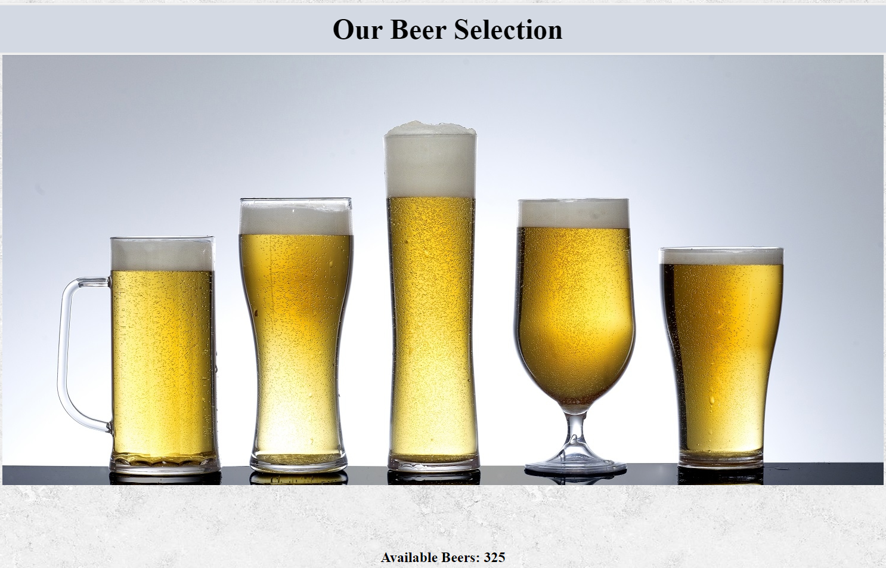

# Nology Punk API Challenge
The purpose of this project is to display a selction of beers from a database hosted at: \
https://api.punkapi.com/v2/beers 
  

  

## How to build this app
mkdir Brew-Dog-Beers \
cd Brew-Dog-Beers \
git clone https://github.com/sydneymurray/nology-punk-api-beer-challenge-production.git \
npm install

## Dependencies
React

## Start front end
npm run start

